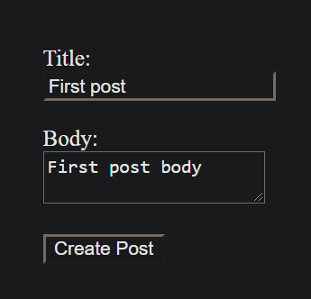
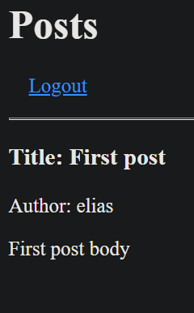
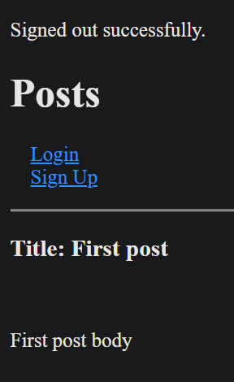

# Members-only

> In this project we created a members only blog where Signed in users can create and see other people's posts as well as watching who created the post, whereas not signed in users can only see the post but not who created it.

## Code execution view:







## Built With

- Ruby on Rails
- Active Records
- Devise

## Getting Started

To get a local copy up and running follow these simple example steps:

- Clone this repository into your local machine.
- Run:

```bash
  $ gem install bundler
```

- Run:

```bash
  $ bundle install
```

- Run

```bash
  $ rails db:migrate
```

- Run the rails server:

```bash
  $ rails server
```

- Enter in your web browser address bar:

    localhost:3000

- Navigate to this address to create a new post after you create a user:

    localhost:3000/posts/new

- Play with the app!

### Validators

- Rubocop
- Stickler

## Authors

👤 **Elias Castañeda**

- Github: [@e71az](https://github.com/e71az)
- Linkedin: [@e71az](https://www.linkedin.com/in/e71az/)

👤 **Daniel Sokil**

- Github: [@danielsokil](https://github.com/danielsokil)
- Linkedin: [@danielsokil](www.linkedin.com/in/daniel-sokil)

## 🤝 Contributing

Contributions, issues and feature requests are welcome!

Feel free to check the [issues page](https://github.com/e71az/members-only/issues).

## Show your support

Give a ⭐️ if you like this project!


## 📝 License

This project is [MIT](lic.url) licensed.
